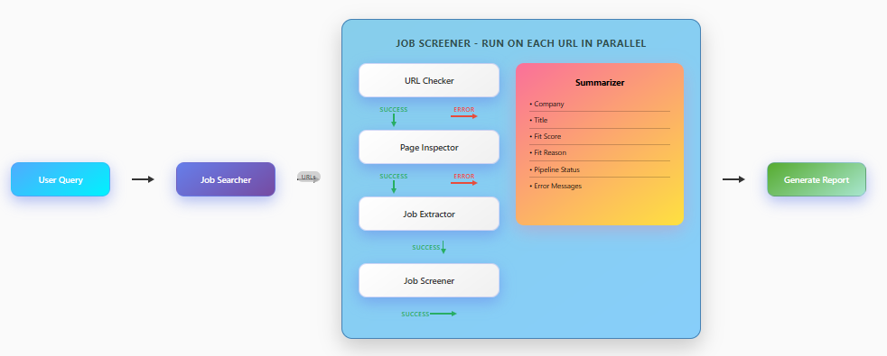

# AI Job Search Agent w/ OpenAI Agents SDK + MCP



## Automated Job Discovery & Screening

An OpenAI Agents SDK-based multi-agent system with specialized agents to:
1. **Search**: Collect job posting URLs.
2. **Screen**: Evaluate each URL against your resume and preferences concurrently, returning fit scores and rationales.

## Table of Contents

- [Key Features](#key-features)
- [Usage](#usage)
- [Agent Descriptions](#agent-descriptions)
  - [Job Searcher](#job-searcher)
  - [Job Screener Multi-Agent](#job-screener-multi-agent)
- [MCP Servers](#mcp-servers)
  - [mcp-searxng (Web Search)](#mcp-searxng-web-search)
  - [Playwright MCP Server (Dynamic Content)](#playwright-mcp-server-dynamic-content)
- [Installation](#installation)
  - [Prerequisites](#prerequisites)
  - [Setup](#setup)
- [Project Structure](#project-structure)
- [Next Steps](#next-steps)

## Key Features

- Multi-Agent Workflow: Specialized agents collaborate sequentially and in parallel.
- MCP Integration: SearxNG for web search and Playwright for dynamic content.
- Fault Tolerance: Automatic error handling and graceful degradation.
- Batch Processing: Default batch size of 5–10 jobs balances throughput and resource usage (each requires a separate Playwright MCP session).

## Usage

Here are three ways to run the pipeline, demonstrated with the sample files `example/resume.txt.sample` and `example/preferences.txt.sample`:

1. Run the full search + screening pipeline and save results. Use `--desired-count` to keep searching additional pages until at least that many jobs are successfully screened.

```bash
python main.py --job_title "software engineer" --output example/report.txt.sample --resume example/resume.txt.sample --preferences example/preferences.txt.sample --log example/logging.log.sample --desired-count 10
```
- You can examine the output in `example/report.txt.sample`

2. Screen only mode, if the user-provides URLs (can be single URL or list of URLs)

```bash
python main.py --job_title "software engineer" --resume example/resume.txt.sample --preferences example/preferences.txt.sample --output example/report.txt.sample --urls https://company.com/careers/ai-engineer-ii https://greenhouse.io/jobs/ml-scientist
```

3. Search only mode, just return URLs without screening

```bash
python main.py --job_title "software engineer" --search-only --output example/report.txt.sample 
```

## Agent Descriptions

### Job Searcher

- Utilizes the `web_search` tool provided by the **mcp-searxng** MCP server to discover job posting URLs.
- For now, issues queries in the format `"<job title> gh_jid"`. Starts on page 1, but continues searching next pages until desired count is reached
- Outputs a list of job URLs wrapped in the `SearchResults` model.

### Job Screener Multi-Agent

Processes each job URL through a sequence of agents linked by handoffs with built-in failsafes:

1. **UrlChecker** (`check_url_reachability` tool)
   - Checks URL reachability via HTTP GET and catches `403`, `404`, and other network errors.
   - If unreachable, records the error and jumps directly to the summary step.

2. **PageInspector** (`browser_navigate` tool)
   - Renders pages (including JavaScript) to verify if the content is a single job description.
   - If not a standalone job page (e.g., redirected to a company career board), logs the inspection reason and skips to summary.

3. **ExtractJobDescription** (`browser_wait_for` tool)
   - Waits up to 10 seconds for dynamic content to load.
   - Extracts company name, job title, and full job description (requirements, responsibilities, qualifications, tools).
   - Filters out unrelated sections such as equal opportunity statements.

4. **JobScreen** (`fetch_job_and_user_info` tool)
   - Evaluates fit between the extracted job description, the user's resume, and their preferences.
   - Assigns a fit score (1–5) with an accompanying rationale.

5. **SummaryAgent** (`fetch_job_screen_result` tool)
   - Consolidates the screening results into `SummaryAgentOutput`.
   - Gracefully logs any failures with the `failed` and `error_message` fields.

In addition to the agents, the system includes local context and handoffs between the agents. Handoffs trigger actions which store typed output into local context. This allows us to not rely on the query history and save input tokens. 

- **Context Threading**: Each agent pipeline maintains a shared `JobScreenContext` that gets populated and passed through the handoff chain, enabling sophisticated state management across agent boundaries.
- **Typed Handoff System**: Uses strongly-typed Pydantic models (`UrlResult`, `JobDescription`, `FitScore`) to ensure data integrity across agent transitions.


## MCP Servers

### mcp-searxng (Web Search)

We use SearXNG as a lean web search tool for the **JobSearcher** agent to avoid limits typical of other search engines, e.g.
- Google Custom Search Engine limits number of results to 100 per query
- Tavily limits the result to 20 per query

The downside to using SearXNG MCP is that we have to keep an docker container running locally as an http endpoint for the search.

To install and configure this server locally:

0. Install [mcp-searxng](https://github.com/ihor-sokoliuk/mcp-searxng)
   ```bash
   npm install -g mcp-searxng
   ```
   
1. Start the SearxNG MCP server:
   ```bash
   docker run -d --name searxng -p 8080:8080 searxng/searxng:latest
   ```
2. Enable JSON output:
   ```bash
   CONTAINER_ID=$(docker ps -qf "name=searxng")
   docker exec -it $CONTAINER_ID /bin/bash
   # In /etc/searxng/settings.yml, under search.formats, add "json"
   vi /etc/searxng/settings.yml
   docker restart searxng
   ```
3. Verify JSON response:
   ```bash
   curl -i "http://localhost:8080/search?q=hello&format=json"
   ```

### Playwright MCP Server (Dynamic Content)

Used by the **PageInspector** and **ExtractJobDescription** agents to render JavaScript-driven pages:

0. Install [playwright-mcp](https://github.com/microsoft/playwright-mcp)
   ```bash
   npm install -g @playwright/mcp
   ```
1. Ensure a `playwright_config/config.json` file is present (configures headless Chromium).
2. Start the Playwright MCP server:
   ```bash
   npx @playwright/mcp@latest --config playwright_config/config.json
   ```
3. Available tools: `browser_navigate`, `browser_wait_for`.

## Installation

### Prerequisites

- Node.js
- Python 3.11+
- Docker

### Setup

```bash
git clone https://github.com/halstonblim/ai-job-search.git
cd job-search-agent-openai
python3 -m venv venv
source venv/bin/activate
pip install -r requirements.txt
```

> Note: Before proceeding, configure and start the MCP servers first (see [MCP Servers](#mcp-servers)).

Configure your environment in a `.env` file:
```ini
OPENAI_API_KEY=your_openai_api_key
```

Ensure both the SearxNG MCP and Playwright MCP servers are running before executing the pipeline. You can run the tutorial test scripts to make sure everything is working properly:
```bash
python scripts/playwright_mcp_tutorial.py
```

and 

```bash
python searxng_mcp_tutorial.py
```


## Project Structure

```text
.
├── main.py                       # Entrypoint to run the job search & screening flow
├── manager.py                    # Orchestrates the multi-agent workflow
├── playwright_config/            # Playwright MCP configuration files
│   ├── config.json               # Playwright MCP configuration
│   ├── package.json              # NPM dependencies for Playwright MCP
│   └── package-lock.json         # NPM lock file
├── job_agents/                   # Agent definitions & shared tools
│   ├── searcher.py               # Builds the Job Searcher agent
│   ├── checker.py                # UrlChecker agent & reachability tool
│   ├── inspector.py              # PageInspector agent
│   ├── extractor.py              # ExtractJobDescription agent
│   ├── screener.py               # JobScreen agent
│   ├── summarizer.py             # SummaryAgent for results
│   └── context.py                # Shared Pydantic models & context management
├── scripts/                      # Tutorial and demo scripts
│   ├── searxng_mcp_tutorial.py       # Setup & use mcp-searxng web search
│   ├── playwright_mcp_tutorial.py    # Setup & use Playwright MCP server
│   └── screening_pipeline_demo.py    # Demo of the screening pipeline
├── example/                      # Sample input/output files
│   ├── resume.txt.sample
│   ├── preferences.txt.sample
│   ├── logging.log.sample
│   └── report.txt.sample
├── requirements.txt              # Python dependencies
└── README.md                     # This file
```

## Next Steps

- Increase number of search results
- Optimize token usage and costs for large-scale searches.
- Deploy with monitoring and autoscaling on cloud platforms.
